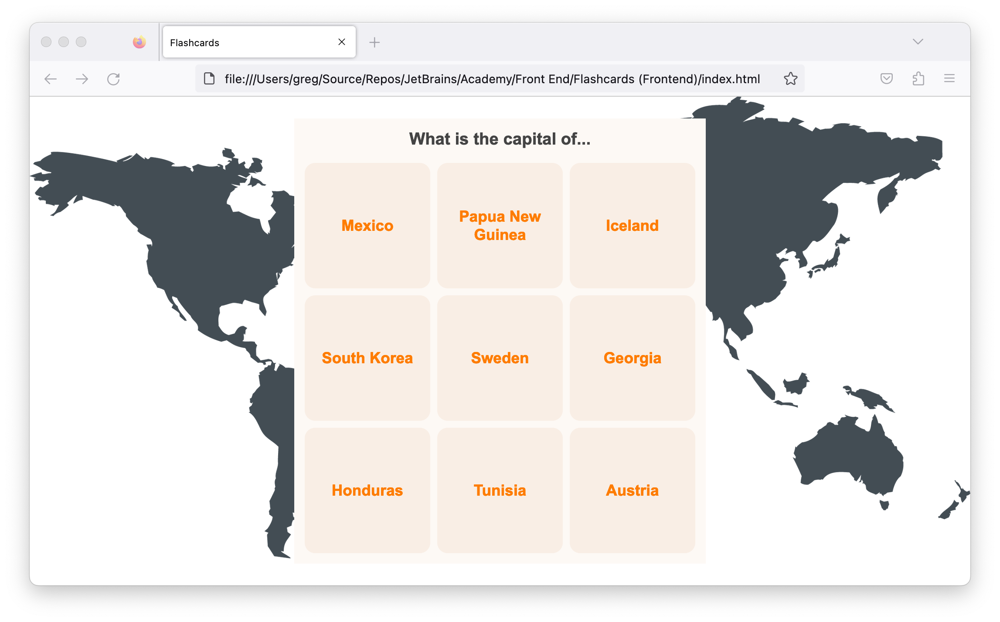
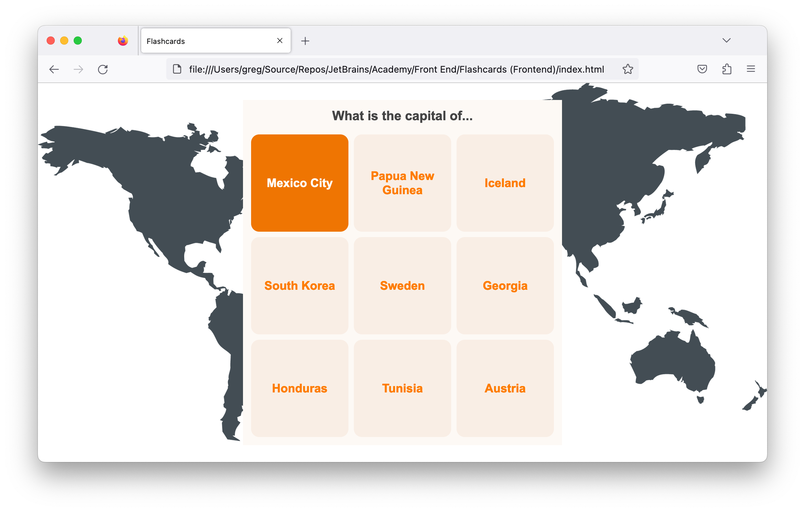

# JetBrains Academy Flashcards (Frontend) Project

An example of a passing solution to the final phase of the JetBrains Academy Frontend Core Flashcards (Frontend) project.

## Description

This project is a flashcard web application. The application has hardcoded country capital questions and answers.
 

Questions are shown on the front of the cards. If the user hovers the mouse over a card, the card flips over to show the answer. The card flipping is animated with a 3d effect.
 

Try the application out at [CodePen](https://codepen.io/kimnetics/pen/MWPeWBR).

## Notes

The relative directory structure was kept the same as the one used in my JetBrains Academy solution.

The project uses [Stylelint](https://stylelint.io/) for CSS linting with the [Recess* Property Order](https://github.com/stormwarning/stylelint-config-recess-order) plugin to ensure consistent ordering of the CSS properties. Most of the CSS standards are from [@mdo's Code Guide](https://codeguide.co/#css-syntax).
